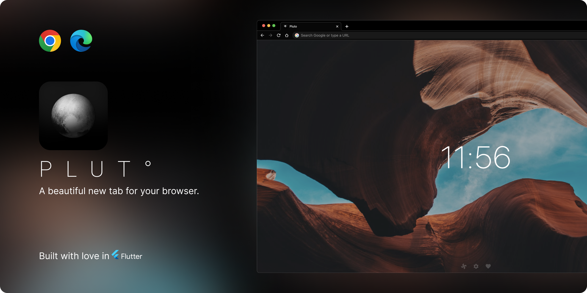

 

  

  

A beautiful new tab for Chrome/Edge built with love ❤️ in <a href="https://flutter.dev/">Flutter</a>.

## Features:
- Select from wide range of background colors and gradients or use huge selection of curated background images from Unsplash.
- Create your own collection of photos you like by adding photos to favorites.
- Set grey-scale or background tint or toggle tint to your liking to make it feel right at home! 
- No analytics, no ads, no tracking. Pure privacy!
- Support local images (Coming soon!)

### Widgets:
1. **Digital/Analog Clock:** Keep track of time by having a clock always on you new tab customized to your liking.
2. **Message:** Write your favorite quotes or quick notes with Message widget.
3. **Timer:** Always keep tabs on your running timer with Timer widget that also allows you to customize the message along with it.
4. **Weather:** Keep an eye out on the surrounding weather with this minimal weather widget.

## Installation

### Install to Chrome/Edge

‎ ‎ ‎ ‎ 

#### Local Install

1. Download 
2. Unzip the file
3. In Chrome/Edge go to the extensions page (`chrome://extensions` or `edge://extensions`).
4. Enable Developer Mode.
5. Drag the unzipped folder anywhere on the page to import it (do not delete the folder afterwards).

## Build from source

1. Clone the repo
2. Install dependencies with `flutter pub get`
3. Run `flutter build web --release --csp`
4. Load the `build/web` directory to your browser

